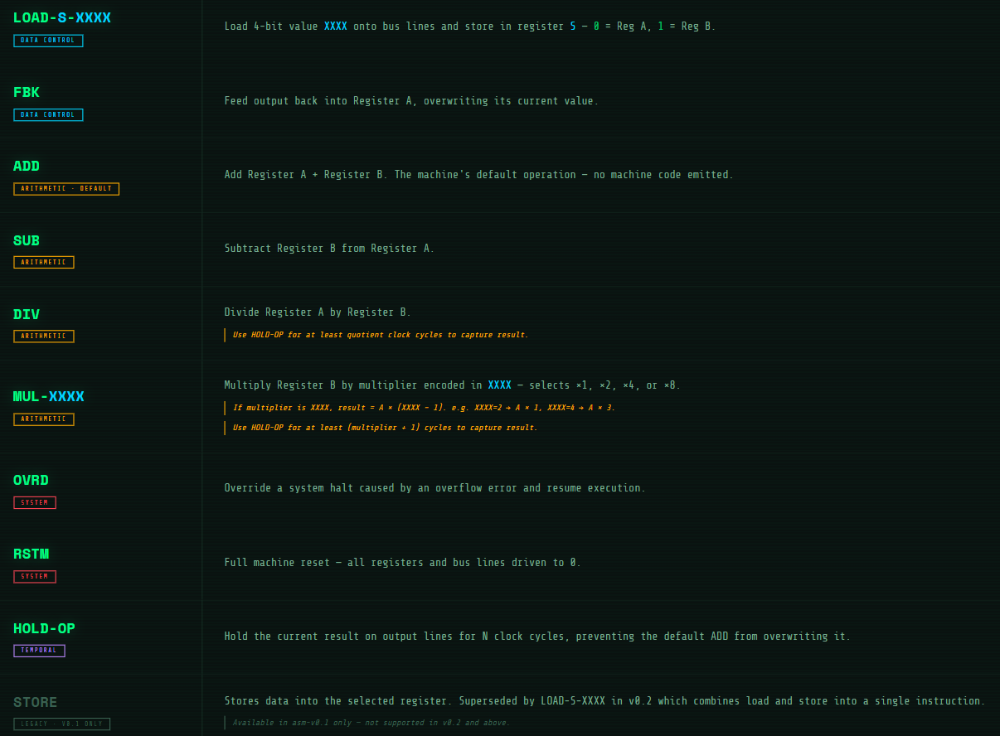

# ⚙️ Assembler
- This is an extension to my [Computing Machinery from Scratch](https://github.com/KARAN-D05/Computing_Machinery_from_Scratch) project, after building an advanced arithmetic machine (called Repeated  Arithmetic Machine aka r_a_m) and in version4 (r_a_mv4) we succesfully implemented 
**Machine-Code Programming** by storing machine code instructions in the program memory.
- So next logical step was to go up the computing stack from machine code to language having instructions in an english like language, called Mnemonics, so after mapping all the machine codes to
 mnemonics we get -**The Assembly Language**.

## 🧾 Custom Assembly Language Instructions - asm-v0
<p align="center">
  
  <br>
  <sub><b> </b></sub>
</p>

👉 [Refer Sample Programs](asm-v0/Sample-Programs)

## ⚙️ Implementation Stack


## 🧱 Versions Built
- [asmv0.1](asm-v0/asm-v0.1) -> Mapped Data control operations to assembly Language.
- [asmv0.2](asm-v0/asm-v0.2) -> Mapped arithmetic, system and temporal Control to assembly Language.
- [asmv0.3](asm-v0/asm-v0.3) -> Added Syntax Analysis, primitive semantic analysis and an instruction execution report.

<p align="center">
  
  <br>
  <sub><b>🧾 Machine Code Output - Assembler v0.2</b></sub>
</p>

<p align="center">
  
  <br>
  <sub><b>🕵️ Syntax Analysis - Assembler v0.3</b></sub>
</p>

<p align="center">
  
  <br>
  <sub><b>🕵️ Semantic Analysis - Assembler v0.3</b></sub>
</p>

## 🧩 Latest Development 
- Syntax Analysis of assembly program before being processed by assembler to save computational resources.
- Primitive semantic analysis to detect logical flaws in assembly program before converting to machine code. 

## 🚀 Future Development 
- Advanced Semantic Analysis for the assembly language, enabling validation and structured interpretation of programs before translation to machine code.
- Mapping multiple sequences of low-level instructions into a single mnemonic, enabling higher-level abstractions and more complex machine functionality with fewer lines of assembly code - `MACROS`

## 🧰 Computing Machinery from Scratch
- To follow along it is advised to check out the underlying hardware upon which we are building the assembly language.
- [Check out Computing Machinery from scratch](https://github.com/KARAN-D05/Computing_Machinery_from_Scratch)

## ⬇️ Download This Repository

### 🪟 Windows
Download → [download_repos.bat](./download_repos.bat)
``` 
Double-click it and pick the repo(s) you want.
```

### 🐧 Linux / macOS
Download → [download_repos.sh](./download_repos.sh)
```
bash

chmod +x download_repos.sh
./download_repos.sh
```

> Always downloads the latest version.

## 🛠️ Toolchain & Repo Utilities - Built to make navigating and interacting with this repo easier

This project includes a built-in reference manual for the custom ASM language that can be queried directly from your terminal. View full manual: [asm-manual](https://github.com/KARAN-D05/Assembler/tree/main/asm-manual)

**Linux / Mac:**
```bash
curl -O https://raw.githubusercontent.com/KARAN-D05/Assembler/main/asm-manual/run-asm-manual.sh
chmod +x run-asm-manual.sh
./run-asm-manual.sh
```

**Windows:**
```powershell
Invoke-WebRequest -Uri "https://raw.githubusercontent.com/KARAN-D05/Assembler/main/asm-manual/run-asm-manual.ps1" -OutFile "run-asm-manual.ps1"
powershell -ExecutionPolicy Bypass -File run-asm-manual.ps1
```

Full computing stack manual covering both the RAM hardware and this Assembly Language. One command for the complete reference: 
View full manual: [stack-manual](https://github.com/KARAN-D05/Assembler/tree/main/stack-manual)

**Linux / Mac:**
```bash
curl -O https://raw.githubusercontent.com/KARAN-D05/Assembler/main/stack-manual/run-stack-manual.sh
chmod +x run-stack-manual.sh
./run-stack-manual.sh
```
**Windows:**
```powershell
Invoke-WebRequest -Uri "https://raw.githubusercontent.com/KARAN-D05/Assembler/main/stack-manual/run-stack-manual.ps1" -OutFile "run-stack-manual.ps1"
powershell -ExecutionPolicy Bypass -File run-stack-manual.ps1
```

### 🔧 portmap - Verilog Port Extractor

`portmap` is a lightweight CLI tool that extracts port definitions (`input`, `output`, `inout`) from Verilog modules and presents them in a clean table or Markdown format.

#### 🔗 Source
https://github.com/KARAN-D05/portmap-HDL/blob/main/portmap.nim

#### 📦 Release (Download Binary)
https://github.com/KARAN-D05/portmap-HDL/releases/tag/v1.0.0

#### 🚀 Usage
```bash
portmap file.v
portmap file.v --md
```

### 🧰 Repo Filetree Generator
[Filetree](https://github.com/KARAN-D05/portmap-HDL/tree/main/utils) - A repository file tree generator that prints a visual directory tree with file-type icons and a file count breakdown by extension (`.v`, `.circ`, `.md`, `.py` and more).
  
**Utils (Portmap + Filetree)- Fetched automatically as a utils package alongside any repo download - includes portmap binaries, filetree, and source code via [download_repos.bat](download_repos.bat) / [download_repos.sh](download_repos.sh).**

## 📜 License
- Source code, HDL, and Logisim circuit files are licensed under the MIT License.
- Documentation, diagrams, images, and PDFs are licensed under Creative Commons Attribution 4.0 (CC BY 4.0).
